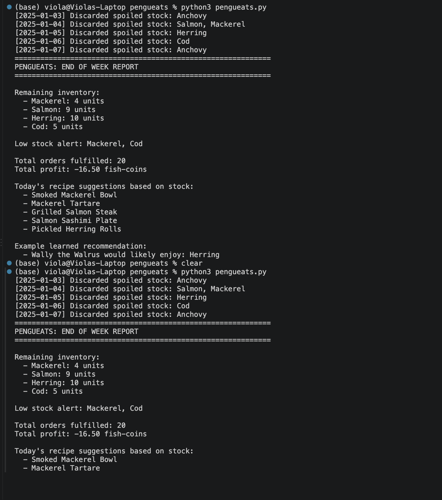
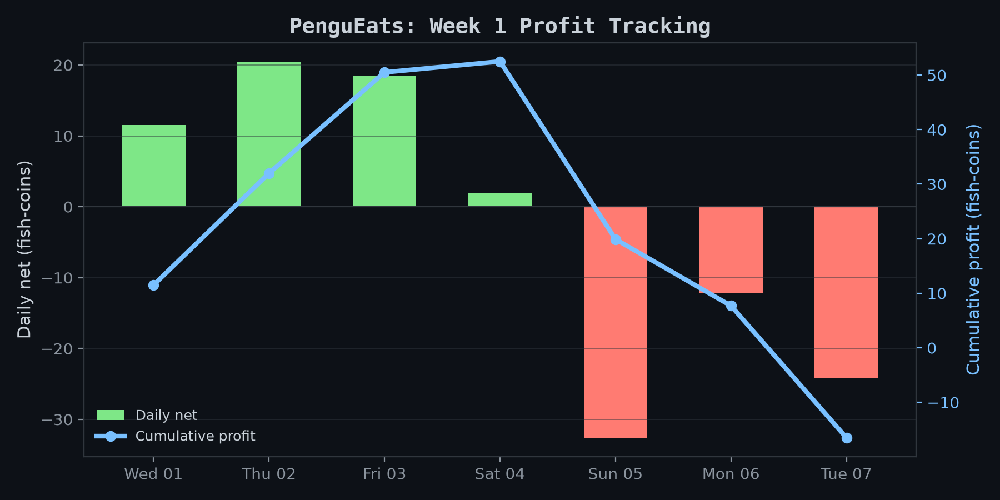
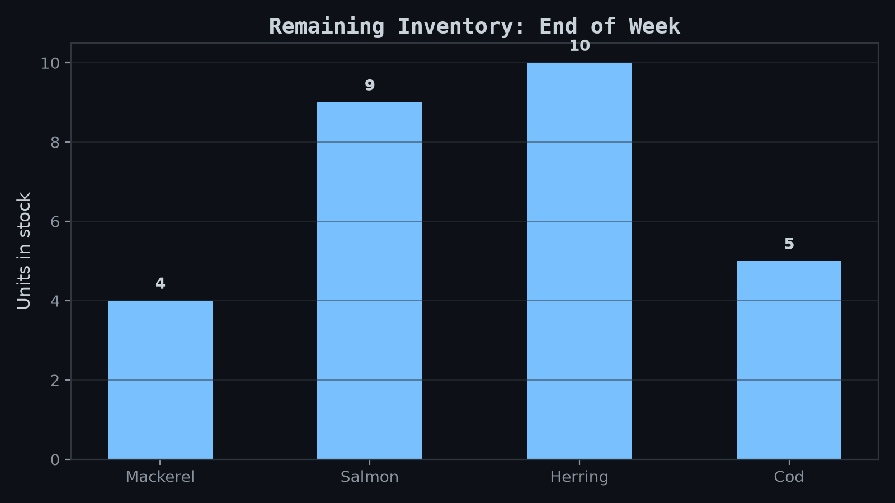
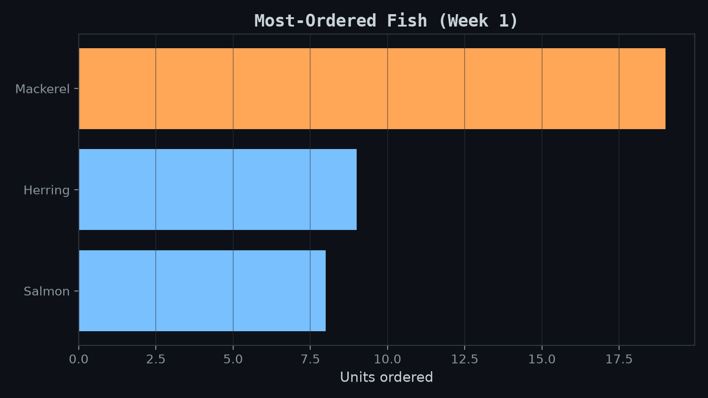

# PenguEats

A Python application that models Pingu the penguin's fish restaurant: inventory management, customer orders, profit tracking, recipe suggestions, and a customer preference learner.

Course: DLBFTPPP01, Project Programming with Python, IU Internationale Hochschule.
Author: Violeta Driza (IU14102196)

## Features

| Requirement | Implementation |
|---|---|
| Manage inventory | `Fish` dataclass + `Inventory` class: tracks quantity and freshness, discards spoiled stock |
| Handle customer orders | `Order` dataclass + `OrderManager.place_order()`: checks stock before fulfilling |
| Track profits and expenses | `Transaction` dataclass + `FinanceTracker`: logs income and expenses, computes daily profit |
| Suggest recipes from stock | `RecipeSuggester.suggest()`: only suggests dishes from fish currently in stock |
| Learn customer preferences | `PreferenceLearner`: a `Counter`-based recommender that learns each customer's favorite fish |

## How to run

```bash
pip install matplotlib

python3 pengueats.py      # runs a one-week simulation, prints a report
python3 make_charts.py    # re-runs the simulation and saves 3 charts as PNG files
```

## Sample output

Running `python3 pengueats.py` produces a real end-of-week report:



## Charts

Generated by `make_charts.py` from real simulation data:





## Architecture

`run_simulation()` in `pengueats.py` is the orchestrator. Each day it restocks `Inventory` and logs rent to `FinanceTracker` directly, then drives three services for every order:

- `OrderManager.place_order()`, checks and deducts stock, logs income
- `RecipeSuggester.suggest()`, reads current stock for dish ideas
- `PreferenceLearner.recommend()` and `learn_from_order()`, learns from and predicts orders

`PreferenceLearner` has no direct link to `Inventory` or `FinanceTracker`, it keeps its own order history and is only ever called by the simulation loop.

## Project structure

```
pengueats/
├── pengueats.py       # the application: all classes + the simulation
├── make_charts.py     # generates charts from a simulation run
├── chart_profit.png
├── chart_inventory.png
├── chart_preferences.png
└── screenshot_terminal_output.png
```